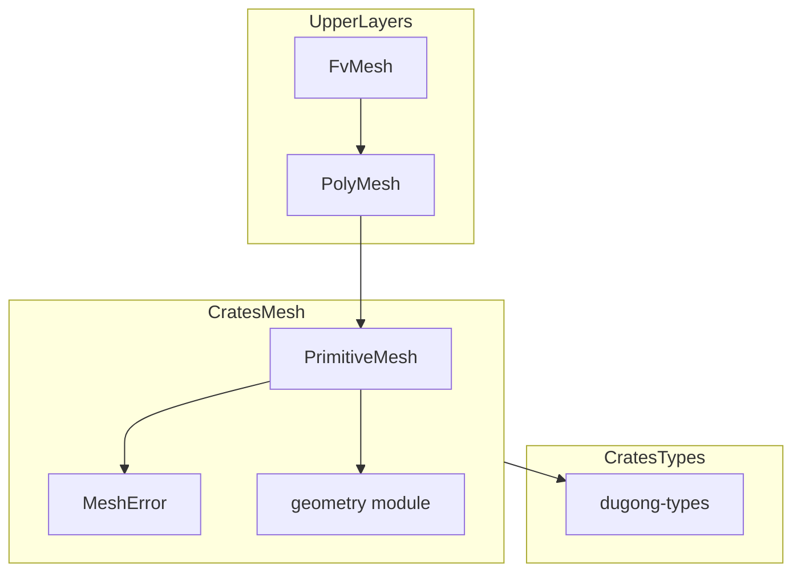
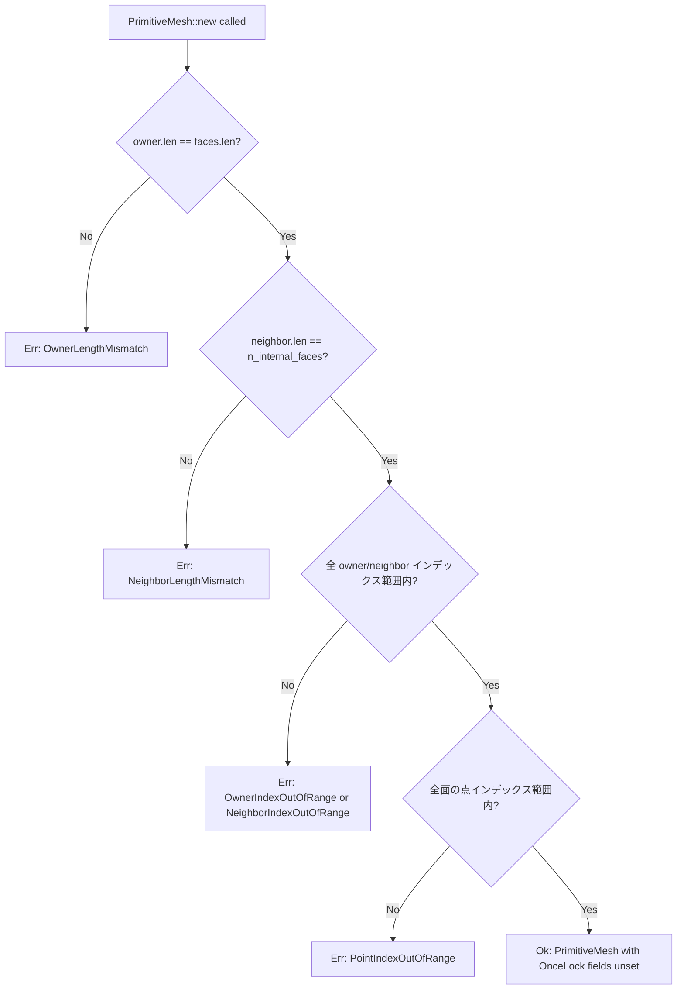
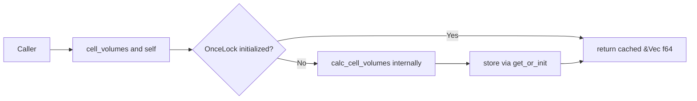

# 技術設計書: mesh-primitive

## 概要

`PrimitiveMesh` は、CFD フレームワーク `dugong` の3層メッシュアーキテクチャにおける第1層（トポロジエンジン）である。点座標・面-頂点接続・所有者/隣接セルインデックスという最小限の基本データを保持し、そこから派生するジオメトリ情報（セル体積・セル中心・面積ベクトル・面中心）と接続情報（cell_cells / cell_faces / cell_points）を `std::sync::OnceLock` による遅延計算でオンデマンドに提供する。

本クレート（`dugong-mesh`）は `crates/mesh/` に実装され、`dugong-types` のみに依存する。上位レイヤーである `PolyMesh`（第2層）・`FvMesh`（第3層）は本 struct を合成（composition）で取り込む。後段の並列フィールド演算（`rayon`）でも安全に共有できるよう、`Send + Sync` を型レベルで保証する。

**対象ユーザー:** フレームワーク開発者・メッシュ構築者・上位レイヤー実装者。

### ゴール

- OpenFOAM 慣行に準拠した任意多面体メッシュのトポロジ表現を Rust で提供する
- 不変条件を構築時に検証し、構築後のデータを不変に保つ
- `OnceLock` を用いた `unsafe` レスの遅延計算で `Send + Sync` を自動保証する
- OpenFOAM 等価なアルゴリズム（テトラへドロン分解、多角形三角形分割）による高精度なジオメトリ計算

### 非ゴール

- `PolyMesh`・`FvMesh` の実装（本スペックは第1層のみ対象）
- メッシュの I/O（ファイル読み込み）は `crates/io/` に委譲
- 動的メッシュ（`move_points` によるキャッシュ無効化）は将来スペックで対応
- MPI 並列分割・halo 交換は `PolyMesh` / `FvMesh` 層で対応

---

## 要件トレーサビリティ

| 要件 | 概要 | コンポーネント | インターフェース | フロー |
|------|------|----------------|-----------------|--------|
| 1.1–1.5 | 基本トポロジデータの格納と不変条件検証 | `PrimitiveMesh` struct, `MeshError` | `new()` コンストラクタ | 構築時バリデーション |
| 2.1–2.6 | セルジオメトリの遅延計算 | `PrimitiveMesh`, `geometry` モジュール | `cell_centers()`, `cell_volumes()` | テトラへドロン分解 |
| 3.1–3.7 | 面ジオメトリの遅延計算 | `PrimitiveMesh`, `geometry` モジュール | `face_centers()`, `face_areas()` | 多角形三角形分割 |
| 4.1–4.7 | セル接続情報の遅延計算 | `PrimitiveMesh` | `cell_cells()`, `cell_faces()`, `cell_points()` | `owner`/`neighbor` からの導出 |
| 5.1–5.4 | スレッド安全性 | `PrimitiveMesh` (`OnceLock` フィールド) | — | 同期: `OnceLock::get_or_init` |
| 6.1–6.8 | 基本トポロジ情報へのアクセサ | `PrimitiveMesh` | `points()`, `faces()`, `owner()` 等 | — |
| 7.1–7.6 | エラーハンドリングと不変条件検証 | `MeshError` enum | `new()` の `Result` 返却 | 構築時バリデーション |
| 8.1–8.6 | テスト可能性と参照実装 | `#[cfg(test)] mod tests` | — | 立方体・不正入力テスト |

---

## アーキテクチャ

### アーキテクチャパターン & 境界マップ



**選択パターン:** 単一責務 struct + 遅延計算（OnceLock）+ 構築時バリデーション
**合成方式:** 上位レイヤーは `PrimitiveMesh` を所有フィールドとして合成する（`Deref` 不使用）
**循環依存:** なし（`dugong-mesh` → `dugong-types` の一方向のみ）

### 技術スタック

| レイヤー | 選択 | 役割 | 備考 |
|----------|------|------|------|
| 言語 | Rust Edition 2024 | — | ワークスペース共通設定 |
| 遅延初期化 | `std::sync::OnceLock` | `&self` からのスレッド安全な遅延計算 | Rust 1.70+ stable; `once_cell` クレート不要 |
| エラー型 | `thiserror` | `MeshError` の `std::error::Error` 実装 | `error-handling.md` 標準に準拠 |
| テスト | `cargo test` (`#[cfg(test)]`) | インラインテスト | ワークスペース共通 |
| 依存 | `dugong-types` (path dep) | 型基盤（`Vector` 型を点座標・ジオメトリデータに使用） | OpenFOAM 同様、メッシュ層でも `Vector` newtype を採用 |

**`OnceLock` 採用根拠:** Rust 1.70+ で stable に昇格した標準ライブラリの `std::sync::OnceLock` は、外部クレート依存なしで `&self` からの一度きりの初期化と `Send + Sync` を提供する。プロジェクトは Edition 2024 を使用しており、`OnceLock` で十分である（詳細は `research.md` 参照）。

---

## システムフロー

### 構築時バリデーションフロー



### 遅延計算フロー（例: `cell_volumes`）



---

## コンポーネント & インターフェース契約

### コンポーネントサマリー

| コンポーネント | ドメイン/レイヤー | 目的 | 要件カバレッジ | 主要依存 |
|----------------|-------------------|------|---------------|----------|
| `PrimitiveMesh` | メッシュトポロジ | 基本データ格納・遅延計算の提供 | 1–8 全要件 | `geometry` モジュール (P0), `MeshError` (P0) |
| `MeshError` | エラー型 | 構築時エラーの型付き表現 | 7.1–7.6 | なし |
| `geometry` モジュール | 計算ユーティリティ | ジオメトリアルゴリズム（内部） | 2.5–2.6, 3.5–3.6 | `dugong-types::Vector` |

---

### トポロジエンジン層

#### `PrimitiveMesh` 構造体

| フィールド | 項目 | 詳細 |
|-----------|------|------|
| 目的 | トポロジエンジン | 基本トポロジデータの保持と遅延計算の提供 |
| 要件 | 1.1–1.5, 2.1–2.6, 3.1–3.7, 4.1–4.7, 5.1–5.4, 6.1–6.8 | — |

**構造体定義:**

```rust
use dugong_types::Vector;

pub struct PrimitiveMesh {
    // --- 基本データ（構築時確定、不変）---
    points: Vec<Vector>,
    faces: Vec<Vec<usize>>,
    owner: Vec<usize>,
    neighbor: Vec<usize>,      // len == n_internal_faces
    n_internal_faces: usize,
    n_cells: usize,

    // --- 遅延計算ジオメトリ ---
    cell_centers: std::sync::OnceLock<Vec<Vector>>,
    cell_volumes: std::sync::OnceLock<Vec<f64>>,
    face_centers: std::sync::OnceLock<Vec<Vector>>,
    face_areas:   std::sync::OnceLock<Vec<Vector>>,

    // --- 遅延計算接続情報 ---
    cell_cells:   std::sync::OnceLock<Vec<Vec<usize>>>,
    cell_faces:   std::sync::OnceLock<Vec<Vec<usize>>>,
    cell_points:  std::sync::OnceLock<Vec<Vec<usize>>>,
}
```

**`Vector` 型の採用根拠:** OpenFOAM では `point` は `typedef vector` であり、メッシュ層でも `vectorField` を一貫して使用している。本設計でも `dugong-types::Vector`（`Copy` 型、`FieldValue` trait 実装済み）をメッシュ層から採用し、上位レイヤー（フィールド・離散化）との型変換を排除する。`mesh_architecture.md` では `[f64; 3]` が使用されているが、これは同文書が `dugong-types::Vector` 実装以前に作成されたためであり、本設計で更新する。

**不変条件（構築時に検証）:**

- `owner.len() == faces.len()`
- `neighbor.len() == n_internal_faces`
- `owner[i] < n_cells` （全 i）
- `neighbor[i] < n_cells` （全 i < n_internal_faces）
- `faces[i][j] < points.len()` （全 i, j）

**依存:**
- 内向き: なし（`new()` 経由でデータを受け取る）
- 外向き: `geometry` モジュール（ジオメトリ計算）, `MeshError`（エラー型）

**Contracts:** Service [x] / State [x]

##### コンストラクタ

```rust
impl PrimitiveMesh {
    pub fn new(
        points: Vec<Vector>,
        faces: Vec<Vec<usize>>,
        owner: Vec<usize>,
        neighbor: Vec<usize>,
        n_internal_faces: usize,
        n_cells: usize,
    ) -> Result<Self, MeshError>
}
```

- **事前条件:** 引数は未検証のトポロジデータ
- **事後条件:** `Ok(PrimitiveMesh)` の場合、全不変条件が満たされている。`OnceLock` フィールドはすべて未初期化
- **不変条件:** 構築成功後、基本データフィールドは変更不可（全フィールド非 `pub`、`&mut self` メソッドなし）

##### 基本アクセサ（要件 6）

```rust
impl PrimitiveMesh {
    pub fn points(&self) -> &[Vector]
    pub fn faces(&self) -> &[Vec<usize>]
    pub fn owner(&self) -> &[usize]
    pub fn neighbor(&self) -> &[usize]
    pub fn n_internal_faces(&self) -> usize
    pub fn n_cells(&self) -> usize
    pub fn n_faces(&self) -> usize        // == self.faces.len()
    pub fn n_points(&self) -> usize       // == self.points.len()
}
```

##### 遅延計算アクセサ（要件 2・3・4）

```rust
impl PrimitiveMesh {
    pub fn cell_centers(&self) -> &[Vector]
    pub fn cell_volumes(&self) -> &[f64]
    pub fn face_centers(&self) -> &[Vector]
    pub fn face_areas(&self) -> &[Vector]
    pub fn cell_cells(&self) -> &[Vec<usize>]
    pub fn cell_faces(&self) -> &[Vec<usize>]
    pub fn cell_points(&self) -> &[Vec<usize>]
}
```

各メソッドは `self.<field>.get_or_init(|| self.calc_<field>())` パターンを用いる。

**実装ノート:**
- 統合: `OnceLock::get_or_init` はブロッキング初期化を保証。複数スレッドが同時に初回アクセスしても計算は一度のみ実行される（要件 5.3 を満たす）
- リスク: ジオメトリ計算間の依存関係（`cell_volumes` 計算が `face_centers` を内部利用する等）がある場合は、計算順序に注意が必要。本設計では各計算は基本データのみに依存する独立した実装とする

---

#### `MeshError` エラー型

| 項目 | 詳細 |
|------|------|
| 目的 | 構築時の不変条件違反を型付きエラーとして表現 |
| 要件 | 7.1–7.6 |

```rust
#[derive(Debug, thiserror::Error)]
pub enum MeshError {
    #[error("owner length mismatch: expected {expected}, got {got}")]
    OwnerLengthMismatch {
        expected: usize,  // faces.len()
        got: usize,       // owner.len()
    },
    #[error("neighbor length mismatch: expected {expected}, got {got}")]
    NeighborLengthMismatch {
        expected: usize,  // n_internal_faces
        got: usize,       // neighbor.len()
    },
    #[error("owner index out of range: face {face}, cell {cell}, n_cells {n_cells}")]
    OwnerIndexOutOfRange {
        face: usize,
        cell: usize,
        n_cells: usize,
    },
    #[error("neighbor index out of range: face {face}, cell {cell}, n_cells {n_cells}")]
    NeighborIndexOutOfRange {
        face: usize,
        cell: usize,
        n_cells: usize,
    },
    #[error("point index out of range: face {face}, point {point}, n_points {n_points}")]
    PointIndexOutOfRange {
        face: usize,
        point: usize,
        n_points: usize,
    },
}
```

**実装ノート:** `error-handling.md` のプロジェクト標準に従い、`thiserror` クレートを `crates/mesh/Cargo.toml` に追加し、`#[derive(thiserror::Error)]` で `Display` と `std::error::Error` を自動導出する。

---

#### `geometry` モジュール（内部実装）

| 項目 | 詳細 |
|------|------|
| 目的 | ジオメトリ計算の内部ユーティリティ関数群 |
| 要件 | 2.5–2.6, 3.5–3.7 |
| 可視性 | `pub(crate)` または `pub(super)` — 外部公開なし |
| 依存型 | `dugong_types::Vector` — 入出力の座標・ベクトル表現に使用 |

**Contracts:** Service [x]

##### 面ジオメトリ計算アルゴリズム

```
入力: points（全点座標）, face（面を構成する頂点インデックスリスト）
```

**面重心（face center）の計算手順:**

1. 面の各頂点の単純平均を参照点 `p_ref` とする
2. 面を `p_ref` を頂点とする三角形列に分割する（面の頂点 `v[i]`, `v[(i+1) % n]`, `p_ref`）
3. 各三角形の重心 `tri_center = (v[i] + v[i+1] + p_ref) / 3`
4. 各三角形の面積ベクトル `tri_area_vec = 0.5 * (v[i] - p_ref) × (v[i+1] - p_ref)`
5. 面積加重平均: `face_center = Σ(tri_center * |tri_area_vec|) / Σ|tri_area_vec|`

**面積ベクトル（face area vector）の計算手順:**

1. 上記の三角形分割を再利用する
2. 各三角形の面積ベクトルを合計: `face_area_vec = Σ tri_area_vec`
3. 向き: `owner` セルから `neighbor` セル向きを正とする（OpenFOAM 慣行に準拠）

**内部関数シグネチャ（例）:**

```rust
pub(crate) fn compute_face_geometry(
    points: &[Vector],
    face: &[usize],
) -> (Vector, Vector)  // (face_center, face_area_vec)
```

##### セルジオメトリ計算アルゴリズム

```
入力: face_centers, face_areas, owner, neighbor, n_internal_faces, n_cells
```

**セル体積（cell volume）の計算手順（テトラへドロン分解）:**

1. 各セルの参照点 `c_ref` として、そのセルに属する全面の面中心の単純平均を使う（初期推定値）
2. セルの各面について、面中心 `fc` と `c_ref` を底面・頂点とするピラミッドの体積を計算する:
   `pyr_vol = face_area_vec · (fc - c_ref) / 3`
   （内積の符号は owner/neighbor の向きに応じて調整）
3. セル体積 = 各ピラミッド体積の合計

**セル中心（cell center）の計算手順:**

1. 各ピラミッドの重心 = `pyr_center = 0.75 * c_ref + 0.25 * fc`
   （ピラミッドの頂点 `c_ref` と底面重心 `fc` を 3:1 に内分する点）
2. 体積加重平均: `cell_center = Σ(pyr_center * pyr_vol) / Σpyr_vol`

**実装ノート:** OpenFOAM の `primitiveMeshGeometry.C` における実装と等価なアルゴリズム。面中心と面積ベクトルはセルジオメトリ計算より先に求める必要がある。本設計では `calc_cell_geometry` 内で面ジオメトリを直接計算することで両者を一括して効率よく求める（`face_centers` / `face_areas` の `OnceLock` とは独立したパスで計算し、重複を避けるため計算済みの場合は `get()` を使って再利用する）。

##### セル接続情報計算アルゴリズム（要件 4）

```rust
// 計算ステップ:
// 1. cell_faces: owner/neighbor を全面で走査し、各セルの面インデックスを収集
// 2. cell_cells: 内部面のみ対象。owner セルの隣接に neighbor を追加（逆も同様）
// 3. cell_points: cell_faces の各面が参照する点インデックスを収集し BTreeSet で重複排除
```

内部関数シグネチャ:

```rust
pub(crate) fn compute_cell_faces(
    owner: &[usize],
    neighbor: &[usize],
    n_internal_faces: usize,
    n_cells: usize,
) -> Vec<Vec<usize>>

pub(crate) fn compute_cell_cells(
    cell_faces: &[Vec<usize>],
    owner: &[usize],
    neighbor: &[usize],
    n_internal_faces: usize,
    n_cells: usize,
) -> Vec<Vec<usize>>

pub(crate) fn compute_cell_points(
    cell_faces: &[Vec<usize>],
    faces: &[Vec<usize>],
    n_cells: usize,
) -> Vec<Vec<usize>>
```

---

## モジュール構造

```
crates/mesh/src/
├── lib.rs              ← pub use によるパブリック API の再エクスポート
├── primitive_mesh.rs   ← PrimitiveMesh struct + impl（アクセサ・遅延計算デリゲート）
├── error.rs            ← MeshError enum + Display + std::error::Error
└── geometry.rs         ← ジオメトリ計算の内部関数（pub(crate)）
```

**モジュール宣言方針（`rust-practices.md` 準拠）:**

- `mod.rs` 方式は使用しない
- `lib.rs` でモジュール宣言と公開 API を管理する

```rust
// lib.rs
mod error;
mod geometry;
mod primitive_mesh;

pub use error::MeshError;
pub use primitive_mesh::PrimitiveMesh;
```

---

## データモデル

### ドメインモデル

- **集約ルート:** `PrimitiveMesh`（単一）
- **不変条件:** 「基本データ 4 種（points, faces, owner, neighbor）+ カウンタ 2 種（n_internal_faces, n_cells）から成るトポロジは、構築後に変更されない」
- **遅延値の整合性:** `OnceLock` で保護された 7 フィールドは、基本データが不変である限り常に基本データから導出可能な同一値になる（参照透明性）

### 物理的データモデル

| フィールド | 型 | メモリ配置 | 備考 |
|------------|----|-----------|----- |
| `points` | `Vec<Vector>` | ヒープ連続メモリ | `Vector([f64; 3])` — `Copy` 型、24 bytes/要素 |
| `faces` | `Vec<Vec<usize>>` | 外側 Vec はヒープ連続 | 面ごとに異なる長さを許容（ジャグ配列） |
| `owner` | `Vec<usize>` | ヒープ連続メモリ | `len == faces.len()` |
| `neighbor` | `Vec<usize>` | ヒープ連続メモリ | `len == n_internal_faces` |
| `cell_centers` | `OnceLock<Vec<Vector>>` | ヒープ連続メモリ（初期化後） | `len == n_cells` |
| `cell_volumes` | `OnceLock<Vec<f64>>` | ヒープ連続メモリ（初期化後） | `len == n_cells` |
| `face_centers` | `OnceLock<Vec<Vector>>` | ヒープ連続メモリ（初期化後） | `len == n_faces` |
| `face_areas` | `OnceLock<Vec<Vector>>` | ヒープ連続メモリ（初期化後） | `len == n_faces`, 法線方向×面積スカラー |
| `cell_cells` | `OnceLock<Vec<Vec<usize>>>` | ジャグ配列（初期化後） | セルごとの隣接セルリスト |
| `cell_faces` | `OnceLock<Vec<Vec<usize>>>` | ジャグ配列（初期化後） | セルごとの所属面リスト |
| `cell_points` | `OnceLock<Vec<Vec<usize>>>` | ジャグ配列（初期化後） | セルごとの頂点リスト（重複なし） |

---

## エラーハンドリング

### エラー戦略

`PrimitiveMesh::new()` は構築時に不変条件を全件検証し、違反があれば即座に `Err(MeshError::*)` を返す（フェイルファスト）。構築後のパニックは発生しない。

### エラーカテゴリと対応

| エラー種別 | バリアント | 検出タイミング | 対応 |
|------------|-----------|--------------|------|
| `owner` 長さ不一致 | `OwnerLengthMismatch` | `new()` 内 | `Err` 返却 |
| `neighbor` 長さ不一致 | `NeighborLengthMismatch` | `new()` 内 | `Err` 返却 |
| `owner` インデックス範囲外 | `OwnerIndexOutOfRange` | `new()` 内 | `Err` 返却 |
| `neighbor` インデックス範囲外 | `NeighborIndexOutOfRange` | `new()` 内 | `Err` 返却 |
| 面の点インデックス範囲外 | `PointIndexOutOfRange` | `new()` 内 | `Err` 返却 |
| 内部不変条件違反 | — | 該当なし（設計上発生不可） | `unreachable!()` |

遅延計算内のパニックは設計上発生しない（計算は検証済みデータのみを参照する）。

### モニタリング

エラーは `std::error::Error` を実装することで、上位クレートやアプリケーション層が `?` 演算子・ログで処理できる。`MeshError` は `Debug` + `Display` を実装するため、エラーの原因（どの面のどのインデックスが範囲外か）を具体的に提示する。

---

## テスト戦略

### 単体テスト（`crates/mesh/src/` 内 `#[cfg(test)]`）

テスト関数命名規約: `test_<対象>_<条件>_<期待結果>`

**構築テスト（要件 1, 7）:**

- `test_new_valid_single_cube_succeeds` — 単一立方体セル（8点・6面）の正常構築
- `test_new_owner_length_mismatch_returns_err` — `owner.len() != faces.len()` で `Err` 確認
- `test_new_neighbor_length_mismatch_returns_err` — `neighbor.len() != n_internal_faces` で `Err` 確認
- `test_new_owner_index_out_of_range_returns_err` — `owner` に範囲外インデックスで `Err` 確認
- `test_new_point_index_out_of_range_returns_err` — 面の点インデックスが範囲外で `Err` 確認

**セルジオメトリテスト（要件 2）:**

- `test_cell_volumes_single_cube_returns_one` — 単位立方体のセル体積 == 1.0（相対誤差 1e-10）
- `test_cell_centers_single_cube_returns_origin` — 単位立方体のセル中心座標（絶対誤差 1e-10）
- `test_cell_volumes_cached_on_second_call` — 2回目の呼び出しで再計算が起きないことを確認（同一ポインタ）

**面ジオメトリテスト（要件 3）:**

- `test_face_areas_single_cube_norm_equals_one` — 単位立方体の各面積ベクトルのノルム == 1.0（相対誤差 1e-10）
- `test_face_areas_direction_owner_to_neighbor` — 面積ベクトルの向きが owner → neighbor であることを確認
- `test_face_areas_sum_zero_for_internal_faces` — 内部面の面積ベクトルの総和がゼロ（絶対誤差 1e-12）

**接続情報テスト（要件 4）:**

- `test_cell_faces_contains_all_adjacent_faces` — セルの所属面が全件含まれること
- `test_cell_cells_correct_neighbors` — 隣接セルリストの正確性
- `test_cell_points_no_duplicates` — 頂点リストに重複なし

**スレッド安全性テスト（要件 5）:**

- `test_primitive_mesh_is_send_sync` — コンパイル時検証: `assert_impl_all!(PrimitiveMesh: Send, Sync)` または `static_assertions` クレートを利用（型チェックのみ）

### 数値比較の基準

- **相対誤差（大きな値）:** `(result - expected).abs() / expected.abs() < 1e-10`
- **絶対誤差（ゼロ近傍）:** `(result - expected).abs() < 1e-12`

### テストデータ: 単一立方体セル

単一立方体（原点中心、一辺 1.0）のトポロジデータは以下の構成で各テストで共有するヘルパー関数 `make_unit_cube_mesh()` として実装する:

```
点 (8点, Vector::new(x, y, z)):
  p0=(0,0,0), p1=(1,0,0), p2=(1,1,0), p3=(0,1,0)
  p4=(0,0,1), p5=(1,0,1), p6=(1,1,1), p7=(0,1,1)

面 (6面, 各面は owner=0 から外向き):
  f0=[0,3,2,1] (z=-面, owner=0, boundary)
  f1=[4,5,6,7] (z=+面, owner=0, boundary)
  f2=[0,1,5,4] (y=-面, owner=0, boundary)
  f3=[2,3,7,6] (y=+面, owner=0, boundary)
  f4=[0,4,7,3] (x=-面, owner=0, boundary)
  f5=[1,2,6,5] (x=+面, owner=0, boundary)

owner=[0,0,0,0,0,0], neighbor=[], n_internal_faces=0, n_cells=1
期待値: cell_volume=1.0, cell_center=(0.5, 0.5, 0.5)
```

---

## パフォーマンス & スケーラビリティ

- `OnceLock` による遅延計算: 不要なジオメトリ計算コストをゼロにする
- `Vec<Vector>` の連続メモリ配置: `Vector` は `Copy` 型（`[f64; 3]` の newtype）でメモリレイアウトが同一。`rayon` の `par_iter` とのキャッシュ親和性が高い
- 将来の動的メッシュ対応: `OnceLock` を `LazyCache`（リセット可能）型に置き換えることで、公開 API を変更せずに対応可能（`rust-practices.md` の型安全性原則に沿う）

---

## 参考資料

- `docs-dev/spec-ideas/mesh_architecture.md` — 3層メッシュアーキテクチャの設計根拠
- OpenFOAM ソース: `src/OpenFOAM/meshes/primitiveMesh/primitiveMeshGeometry.C` — アルゴリズム参照
- `research.md` — `OnceLock` vs `OnceCell` の比較、アルゴリズム詳細
