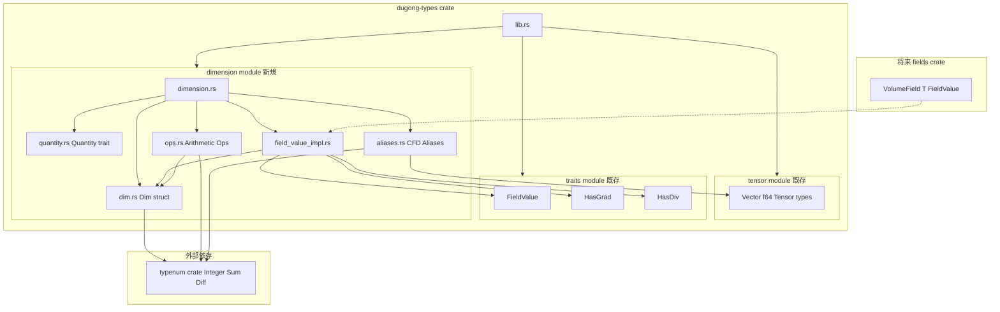
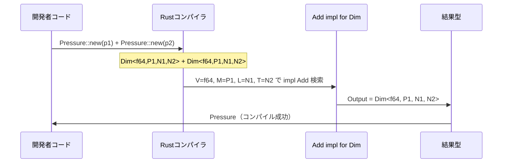
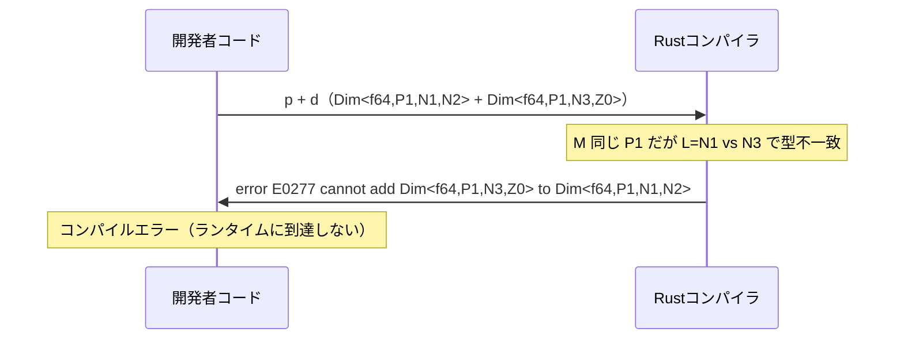
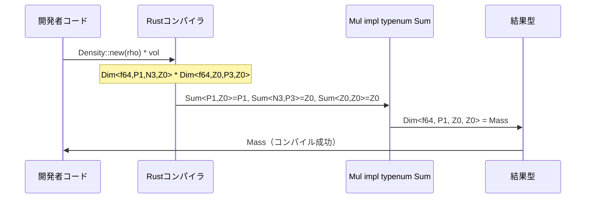

# 技術設計書 — types-dimension

## Overview

本機能は、Dugong CFD フレームワークの `crates/types` クレートにコンパイル時次元検査システムを追加する。`Dim<V, M, L, T>` 構造体を中心に、物理次元の整合性を Rust の型システム（`typenum` クレートの型レベル整数算術）によってコンパイル時に保証する。

**Purpose**: 次元付き物理量を型として表現し、`Pressure + Velocity` のような無効な演算をコンパイルエラーとして検出する。`Density * Volume → Mass` のような異次元乗除算でも正しい結果次元の型が得られる。

**Users**: `crates/types` を利用する `crates/fields`・`crates/discretization`・`apps/` 配下の開発者が `Pressure`・`Velocity` 等の型エイリアスを通じて次元付きフィールドを自然に記述できる。

**Impact**: 既存の `tensor` モジュール・`traits` モジュールには変更を加えない。新規 `dimension` モジュールを追加し、`lib.rs` から再エクスポートする。`typenum = "1"` を regular dependency として追加する。

### Goals

- `Dim<V, M, L, T>` による物理次元の型レベル表現（stable Rust）
- 同次元の加算・減算と、異次元の乗算・除算（`typenum` による型レベル次元指数算術）
- 異次元加算・減算のコンパイルエラー保証
- CFD 標準物理量の型エイリアス（`Pressure`・`Velocity` 等 8 種）
- `FieldValue`・`HasGrad`・`HasDiv` の実装による上位レイヤー統合

### Non-Goals

- 温度・電流・光度等 SI 基本次元の全網羅（M・L・T の 3 次元のみ）
- 単位変換機能（Pa → atm 等）
- 実行時次元検査
- `fvm`・`fvc` 演算子の実装（`fields` クレート以降のスコープ）
- nightly Rust 依存機能の使用

---

## Requirements Traceability

| 要件 | 概要 | コンポーネント | インターフェース |
|------|------|----------------|----------------|
| 1.1 | Dim 構造体定義 | `Dim`（dim.rs） | `struct Dim<V, M: Integer, L: Integer, T: Integer>` |
| 1.2 | `new` コンストラクタ | `Dim`（dim.rs） | `fn new(value: V) -> Self` |
| 1.3 | `value` メソッド | `Dim`（dim.rs） | `fn value(&self) -> V where V: Copy` |
| 1.4 | derive トレイト | `Dim`（dim.rs） | `#[derive(Debug, Clone, Copy, PartialEq)]` |
| 1.5 | モジュール配置 | モジュール構成 | `pub mod dimension` in `lib.rs` |
| 2.1 | Quantity トレイト定義 | `Quantity`（quantity.rs） | `trait Quantity { type Value; }` |
| 2.2 | Quantity の Dim 実装 | `Quantity`（quantity.rs） | `impl<V, M, L, T> Quantity for Dim<V, M, L, T>` |
| 2.3 | dimension/ への配置 | `dimension.rs` | `pub use quantity::Quantity` |
| 2.4 | FieldValue との接合 bound | 使用パターン | `T: Quantity where T::Value: FieldValue` |
| 3.1 | 同次元 Add | `DimOps`（ops.rs） | `impl<V: Add<Output=V>, M, L, T> Add for Dim<V, M, L, T>` |
| 3.2 | 同次元 Sub | `DimOps`（ops.rs） | `impl<V: Sub<Output=V>, M, L, T> Sub for Dim<V, M, L, T>` |
| 3.3 | Neg | `DimOps`（ops.rs） | `impl<V: Neg<Output=V>, M, L, T> Neg for Dim<V, M, L, T>` |
| 3.4 | Mul\<f64\> | `DimOps`（ops.rs） | `impl<V: Mul<f64, Output=V>, M, L, T> Mul<f64> for Dim<V, M, L, T>` |
| 4.1 | 異次元 Mul | `DimOps`（ops.rs） | `type Output = Dim<..., Sum<M1,M2>, Sum<L1,L2>, Sum<T1,T2>>` |
| 4.2 | 異次元 Div | `DimOps`（ops.rs） | `type Output = Dim<..., Diff<M1,M2>, Diff<L1,L2>, Diff<T1,T2>>` |
| 4.3 | f64 値の乗除算 | `DimOps`（ops.rs） | `Mul<f64>` および `Div<f64>` |
| 4.4 | 無次元スカラー倍 | `DimOps`（ops.rs） | `Mul<f64, Output=Dim<V, M, L, T>>`（次元不変） |
| 5.1 | 異次元 Add コンパイルエラー | `CompileFailTests`（tests/） | trybuild compile_fail |
| 5.2 | 異次元 Sub コンパイルエラー | `CompileFailTests`（tests/） | trybuild compile_fail |
| 5.3 | tests/ への配置 | テスト構成 | `crates/types/tests/compile_fail_dimension.rs` |
| 6.1 | 主要型エイリアス | `Aliases`（aliases.rs） | `Pressure`、`Velocity`、`Density` |
| 6.2 | 追加型エイリアス | `Aliases`（aliases.rs） | `DynamicViscosity`、`KinematicViscosity`、`Length`、`Time`、`Mass` |
| 6.3 | 直接インポート | `lib.rs` 再エクスポート | `pub use dimension::{Pressure, Velocity, ...}` |
| 7.1 | FieldValue impl | `DimFieldValue`（field_value_impl.rs） | blanket impl where `V: FieldValue` |
| 7.2 | HasGrad impl | `DimFieldValue`（field_value_impl.rs） | `type GradOutput = Dim<V::GradOutput, M, L, T>` |
| 7.3 | HasDiv impl | `DimFieldValue`（field_value_impl.rs） | `type DivOutput = Dim<V::DivOutput, M, L, T>` |
| 7.4 | VolumeField 統合 | 型レベル検証 | `VolumeField<Dim<V, M, L, T>, State>` が型として成立 |
| 8.1–8.4 | ドキュメント・品質 | 全コンポーネント | `///` コメント、clippy、cargo test |

---

## Architecture

### Existing Architecture Analysis

`crates/types` は現在 2 つのモジュールで構成される：

- `tensor`（Spec 1-1 完了）: `Vector`・`Tensor`・`SymmTensor`・`SphericalTensor`・`f64` の定義と演算
- `traits`（Spec 1-2 完了）: `FieldValue`・`HasGrad`・`HasDiv` トレイトの定義と `f64`・テンソル型への実装

`dimension` モジュールは既存モジュールに **変更を加えず**、これらを利用する形で追加される。

### Architecture Pattern & Boundary Map



**Key Decisions**:
- `typenum` の型レベル整数（`Integer` trait + `Sum`/`Diff` 型演算子）を使用し、stable Rust で次元算術を実現
- `dimension` モジュールは `tensor` / `traits` を参照するが、逆方向の依存は持たない（一方向性を維持）
- `field_value_impl.rs` が `tensor` の型と `traits` の trait を橋渡しする唯一の統合点
- `Dim` の型パラメータ `M, L, T` は zero-sized の `PhantomData<(M, L, T)>` として保持される

### Technology Stack & Alignment

| レイヤー | 選択 / バージョン | 役割 | 備考 |
|---------|-----------------|------|------|
| 次元算術 | `typenum = "1"` | 型レベル整数・加減算 | stable Rust。`nalgebra`・`uom` と同一アプローチ |
| テスト | `trybuild = "1"` (dev) | compile_fail テストの `tests/` 配置 | dtolnay 作の標準クレート（MIT/Apache-2.0） |
| 言語 | Rust Edition 2024 (stable) | — | nightly 不要（`generic_const_exprs` を不採用） |
| 既存スタック | `crates/types` の既存構成 | tensor / traits の再利用 | 変更なし |

> `generic_const_exprs` を不採用とした根拠・代替案評価は `research.md` §Architecture Pattern Evaluation 参照。

---

## System Flows

### 同次元加算の型推論フロー



### 異次元加算のコンパイルエラー



### 異次元乗算の型レベル次元算術フロー



---

## Components and Interfaces

### コンポーネントサマリー

| コンポーネント | レイヤー | 役割 | 要件カバレッジ | 主要依存 |
|--------------|---------|------|--------------|---------|
| `Dim` struct | dimension/dim.rs | 次元付き量のコア型 | 1.1–1.5 | typenum::Integer |
| `Quantity` trait | dimension/quantity.rs | 次元付き量の統一 IF | 2.1–2.4 | Dim |
| `DimOps` | dimension/ops.rs | 算術演算子実装 | 3.1–3.4, 4.1–4.4 | Dim, typenum::{Sum, Diff} |
| `Aliases` | dimension/aliases.rs | CFD 型エイリアス | 6.1–6.3 | Dim, typenum::{P1,N1,...} |
| `DimFieldValue` | dimension/field_value_impl.rs | traits 統合 | 7.1–7.4 | Dim, FieldValue, HasGrad, HasDiv |
| `CompileFailTests` | tests/ | 次元不整合コンパイルエラー保証 | 5.1–5.3 | trybuild |

---

### dimension layer

#### Dim 構造体（dim.rs）

| Field | Detail |
|-------|--------|
| Intent | 物理次元を typenum 型パラメータとして保持するコア型。ゼロコスト抽象化。 |
| Requirements | 1.1, 1.2, 1.3, 1.4, 1.5 |

**Responsibilities & Constraints**
- SI 次元指数 M（質量）・L（長さ）・T（時間）を `typenum::Integer` 実装型として保持
- `_phantom: PhantomData<(M, L, T)>` はゼロサイズフィールド。`size_of::<Dim<V, M, L, T>>() == size_of::<V>()`
- `#[derive(Debug, Clone, Copy, PartialEq)]` は `V` および typenum 型（常に実装済み）が各トレイトを満たす場合に有効

**Contracts**: Service [x]

##### Service Interface

```rust
use typenum::Integer;
use std::marker::PhantomData;

/// 物理次元付き量。M: 質量, L: 長さ, T: 時間の SI 次元指数を型パラメータで保持する。
///
/// 次元指数は `typenum` の型レベル整数（`P1`, `N1`, `Z0` 等）で表現される。
/// 直接使用するよりも型エイリアス（[`Pressure`], [`Velocity`] 等）を推奨する。
///
/// # Examples
///
/// ```
/// use dugong_types::{Pressure, Velocity};
/// use dugong_types::tensor::Vector;
///
/// let p = Pressure::new(101325.0);
/// let v = Velocity::new(Vector::new(1.0, 0.0, 0.0));
/// assert_eq!(p.value(), 101325.0);
/// ```
#[derive(Debug, Clone, Copy, PartialEq)]
pub struct Dim<V, M: Integer, L: Integer, T: Integer> {
    value: V,
    _phantom: PhantomData<(M, L, T)>,
}

impl<V, M: Integer, L: Integer, T: Integer> Dim<V, M, L, T> {
    /// 値を包んで次元付き量を生成する。
    pub fn new(value: V) -> Self;

    /// 内部の生の値を返す。
    pub fn value(&self) -> V
    where
        V: Copy;
}
```

- Preconditions: なし（任意の `V` を受け入れる）
- Postconditions: `Dim::new(v).value() == v`（V: Copy の場合）
- Invariants: `M`, `L`, `T` は型パラメータであり実行時に変化しない。`PhantomData` によりゼロコスト。

**Implementation Notes**
- `_phantom` フィールドの初期化: `PhantomData` はユーザーから隠蔽し、`new()` のみで構築可能にする
- `#[repr(transparent)]` を付与する（`PhantomData` はゼロサイズのため適法）。`value` フィールドと同一メモリレイアウトを保証しビルド最適化を促進

---

#### Quantity トレイト（quantity.rs）

| Field | Detail |
|-------|--------|
| Intent | 次元付き量の associated type による統一インターフェース |
| Requirements | 2.1, 2.2, 2.3, 2.4 |

**Contracts**: Service [x]

##### Service Interface

```rust
use typenum::Integer;

/// 次元付き量が保持する値の型を公開するトレイト。
///
/// `fvm` 演算子が `T: Quantity where T::Value: FieldValue` として
/// 次元付きフィールドを受け取り、次元なし `FvMatrix` を返す境界を定義する。
pub trait Quantity {
    /// 内部値の型。`FieldValue` bound と組み合わせて上位レイヤーと接続する。
    type Value;
}

impl<V, M: Integer, L: Integer, T: Integer> Quantity for Dim<V, M, L, T> {
    type Value = V;
}
```

---

#### 算術演算子（ops.rs）

| Field | Detail |
|-------|--------|
| Intent | 同次元・異次元の算術演算子を `std::ops` トレイトとして stable Rust で実装 |
| Requirements | 3.1, 3.2, 3.3, 3.4, 4.1, 4.2, 4.3, 4.4 |

**Contracts**: Service [x]

##### Service Interface

```rust
use typenum::{Integer, Sum, Diff};
// typenum::Add / typenum::Sub は型レベル演算（std::ops とは別トレイト）
// ops.rs 内では use を分けて管理する

// ── 同次元演算（M, L, T の型が完全一致する場合のみコンパイル成功）──

impl<V: std::ops::Add<Output = V>, M: Integer, L: Integer, T: Integer>
    std::ops::Add for Dim<V, M, L, T>
{
    type Output = Dim<V, M, L, T>;
    // 要件 3.1: 型パラメータが一致しない場合は Add impl が存在しない → コンパイルエラー
}

impl<V: std::ops::Sub<Output = V>, M: Integer, L: Integer, T: Integer>
    std::ops::Sub for Dim<V, M, L, T>
{
    type Output = Dim<V, M, L, T>;
    // 要件 3.2
}

impl<V: std::ops::Neg<Output = V>, M: Integer, L: Integer, T: Integer>
    std::ops::Neg for Dim<V, M, L, T>
{
    type Output = Dim<V, M, L, T>;
    // 要件 3.3
}

impl<V: std::ops::Mul<f64, Output = V>, M: Integer, L: Integer, T: Integer>
    std::ops::Mul<f64> for Dim<V, M, L, T>
{
    type Output = Dim<V, M, L, T>;
    // 要件 3.4 / 4.4: f64 スカラー倍、次元は不変
}

impl<V: std::ops::Div<f64, Output = V>, M: Integer, L: Integer, T: Integer>
    std::ops::Div<f64> for Dim<V, M, L, T>
{
    type Output = Dim<V, M, L, T>;
    // 要件 4.3: f64 スカラー除算、次元は不変
}

// ── 異次元乗算（typenum::Add で次元指数を型レベルで加算）──

impl<V1, V2, M1, M2, L1, L2, T1, T2>
    std::ops::Mul<Dim<V2, M2, L2, T2>> for Dim<V1, M1, L1, T1>
where
    V1: std::ops::Mul<V2>,
    M1: Integer + typenum::Add<M2>,  // typenum::Add は型レベル加算
    M2: Integer,
    L1: Integer + typenum::Add<L2>,
    L2: Integer,
    T1: Integer + typenum::Add<T2>,
    T2: Integer,
    Sum<M1, M2>: Integer,
    Sum<L1, L2>: Integer,
    Sum<T1, T2>: Integer,
{
    type Output = Dim<
        <V1 as std::ops::Mul<V2>>::Output,
        Sum<M1, M2>,
        Sum<L1, L2>,
        Sum<T1, T2>,
    >;
    // 要件 4.1: Sum<M1,M2> は typenum が stable で計算する
}

// ── 異次元除算（typenum::Sub で次元指数を型レベルで減算）──

impl<V1, V2, M1, M2, L1, L2, T1, T2>
    std::ops::Div<Dim<V2, M2, L2, T2>> for Dim<V1, M1, L1, T1>
where
    V1: std::ops::Div<V2>,
    M1: Integer + typenum::Sub<M2>,
    M2: Integer,
    L1: Integer + typenum::Sub<L2>,
    L2: Integer,
    T1: Integer + typenum::Sub<T2>,
    T2: Integer,
    Diff<M1, M2>: Integer,
    Diff<L1, L2>: Integer,
    Diff<T1, T2>: Integer,
{
    type Output = Dim<
        <V1 as std::ops::Div<V2>>::Output,
        Diff<M1, M2>,
        Diff<L1, L2>,
        Diff<T1, T2>,
    >;
    // 要件 4.2
}
```

- Preconditions: 同次元演算では型パラメータ `M`, `L`, `T` が完全一致すること（型レベルで保証）
- Postconditions: 同次元加算の出力型は入力と同一次元
- Invariants: 次元指数の算術はコンパイル時のみ（ゼロコスト）

**Implementation Notes**
- `typenum::Add`（型レベル）と `std::ops::Add`（値レベル）を混同しないよう、ファイル先頭の `use` で明示的に分離する（`use std::ops::{Add as StdAdd, ...}` 等）
- `Mul<f64>` と `Mul<Dim<...>>` は `Rhs` 型が異なるため impl 競合なし

---

#### CFD 型エイリアス（aliases.rs）

| Field | Detail |
|-------|--------|
| Intent | 頻用 CFD 物理量に意味のある名前を与える型エイリアス |
| Requirements | 6.1, 6.2, 6.3 |

**Contracts**: Service [x]

##### Service Interface

```rust
use typenum::{P1, P2, P3, N1, N2, N3, Z0};
use crate::tensor::Vector;
use super::dim::Dim;

// P1=+1, P2=+2, P3=+3, N1=-1, N2=-2, N3=-3, Z0=0

/// 圧力 (Pa = kg·m⁻¹·s⁻²)
pub type Pressure           = Dim<f64, P1, N1, N2>;

/// 速度 (m·s⁻¹)。Vector 値を保持する。
pub type Velocity           = Dim<Vector, Z0, P1, N1>;

/// 密度 (kg·m⁻³)
pub type Density            = Dim<f64, P1, N3, Z0>;

/// 動粘性係数 (Pa·s = kg·m⁻¹·s⁻¹)
pub type DynamicViscosity   = Dim<f64, P1, N1, N1>;

/// 動粘性率 (m²·s⁻¹)
pub type KinematicViscosity = Dim<f64, Z0, P2, N1>;

/// 長さ (m)
pub type Length             = Dim<f64, Z0, P1, Z0>;

/// 時間 (s)
pub type Time               = Dim<f64, Z0, Z0, P1>;

/// 質量 (kg)
pub type Mass               = Dim<f64, P1, Z0, Z0>;
```

**Implementation Notes**
- `lib.rs` から `pub use dimension::{Pressure, Velocity, Density, DynamicViscosity, KinematicViscosity, Length, Time, Mass};` で直接インポート可能にする（要件 6.3）

---

#### FieldValue / HasGrad / HasDiv 統合（field_value_impl.rs）

| Field | Detail |
|-------|--------|
| Intent | `Dim<V, M, L, T>` を traits システムに接続し、上位レイヤーとの型統合を確立 |
| Requirements | 7.1, 7.2, 7.3, 7.4 |

**Dependencies**
- Inbound: `fields` クレート（将来）— `VolumeField<Dim<V, M, L, T>, State>` として使用（P1）
- Outbound: `FieldValue`、`HasGrad`、`HasDiv`（traits module, P0）
- Outbound: `Dim` struct（dim.rs, P0）

**Contracts**: Service [x]

##### Service Interface

```rust
use typenum::Integer;
use crate::traits::{FieldValue, HasDiv, HasGrad};
use super::dim::Dim;

/// V: FieldValue のとき Dim<V, M, L, T> も FieldValue を実装する。
///
/// FieldValue のスーパートレイト（Copy, Add, Sub, Mul<f64>, Neg）は
/// V: FieldValue と ops.rs の演算子実装によって自動的に充足される。
impl<V: FieldValue, M: Integer, L: Integer, T: Integer> FieldValue for Dim<V, M, L, T> {
    fn zero() -> Self;    // Dim::new(V::zero())
    fn mag(&self) -> f64; // self.value.mag()
}

/// V: FieldValue + HasGrad のとき HasGrad を実装する。
/// 次元指数は変わらず、値のテンソルランクが昇格する。
///
/// 例: Dim<f64, M, L, T> の grad → Dim<Vector, M, L, T>
impl<V: FieldValue + HasGrad, M: Integer, L: Integer, T: Integer> HasGrad for Dim<V, M, L, T> {
    type GradOutput = Dim<V::GradOutput, M, L, T>;
    // V::GradOutput: FieldValue は HasGrad が保証
    // Dim<V::GradOutput, M, L, T>: FieldValue は上記ブランケット impl が充足
}

/// V: FieldValue + HasDiv のとき HasDiv を実装する。
///
/// 例: Dim<Vector, M, L, T> の div → Dim<f64, M, L, T>
impl<V: FieldValue + HasDiv, M: Integer, L: Integer, T: Integer> HasDiv for Dim<V, M, L, T> {
    type DivOutput = Dim<V::DivOutput, M, L, T>;
}
```

- Preconditions: `V: FieldValue`
- Postconditions: `Dim<V, M, L, T>` が `VolumeField<Dim<V, M, L, T>, State>` の型引数として使用可能
- Invariants: 次元指数は `grad`・`div` 操作で変化しない

---

#### コンパイル失敗テスト（tests/）

| Field | Detail |
|-------|--------|
| Intent | 異次元加算・減算がコンパイルエラーになることを自動テストとして固定 |
| Requirements | 5.1, 5.2, 5.3 |

**Dependencies**
- External: `trybuild = "1"` — dev-dependency（P0）

**Contracts**: Batch [x]

##### Batch / Job Contract

- Trigger: `cargo test -p dugong-types`
- Input: `tests/compile_fail/` ディレクトリ内の `.rs` ファイル群
- Output: 各ファイルがコンパイルエラーになることを確認
- Idempotency: 冪等

**テストファイル構成**

```
crates/types/
  tests/
    compile_fail_dimension.rs       ← trybuild テストランナー
    compile_fail/
      add_different_dims.rs         ← 異次元 Add（同 V、異 M/L/T）
      sub_different_dims.rs         ← 異次元 Sub（同 V、異 M/L/T）
```

**テストランナー（compile_fail_dimension.rs）**

```rust
#[test]
fn compile_fail_dimension_tests() {
    let t = trybuild::TestCases::new();
    t.compile_fail("tests/compile_fail/add_different_dims.rs");
    t.compile_fail("tests/compile_fail/sub_different_dims.rs");
}
```

**失敗するべきコード例（add_different_dims.rs）**

```rust
// Dim<f64, P1, N1, N2>（Pressure型相当）と Dim<f64, P1, N3, Z0>（Density型相当）の加算
// 同じ V=f64 だが L と T が異なる → Add impl が存在しない → コンパイルエラー
use dugong_types::dimension::Dim;
use typenum::{P1, N1, N2, N3, Z0};
fn main() {
    let p: Dim<f64, P1, N1, N2> = Dim::new(101325.0);
    let d: Dim<f64, P1, N3, Z0> = Dim::new(1000.0);
    let _ = p + d;
}
```

---

## Data Models

### Domain Model

- **`Dim<V, M, L, T>`**: 値オブジェクト。値 `V` と次元指数型 `M`, `L`, `T`（typenum）の組
- **Quantity**: `Dim` の `type Value = V` を公開するマーカーインターフェース
- **型エイリアス**: `Pressure` 等は型シノニム。型消去なし。コンパイル後は `Dim<f64, P1, N1, N2>` と同一

### Logical Data Model

```
Dim<V, M: Integer, L: Integer, T: Integer>
  ├── value: V                    （実際の物理量値）
  └── _phantom: PhantomData<(M, L, T)>  （ゼロサイズ・型パラメータの保持のみ）
```

`PhantomData` はゼロサイズのため `size_of::<Dim<V, M, L, T>>() == size_of::<V>()`。

---

## Error Handling

### Error Strategy

本機能のエラーは **すべてコンパイル時** に発生する。実行時エラーは設計上存在しない。

### Error Categories and Responses

| カテゴリ | 発生条件 | コンパイラの応答 |
|---------|---------|----------------|
| 異次元加算 | `Dim<V, M1, L1, T1> + Dim<V, M2, L2, T2>`（型パラメータ不一致） | E0277: cannot add — Add impl が存在しない |
| 異次元減算 | 同上（Sub） | E0277: cannot subtract |
| 非 FieldValue 型での Dim FieldValue 使用 | `V: FieldValue` を満たさない場合 | E0277: trait bound not satisfied |
| HasGrad 未実装型 | `V: HasGrad` を満たさない場合（例: `SymmTensor`） | E0277: the trait bound is not satisfied |

**注意**: typenum 由来のエラーメッセージは `Dim<f64, PInt<UInt<UTerm, B1>>, ...>` のように冗長になる場合がある。型エイリアス（`Pressure`、`Velocity` 等）を経由すればエラー箇所が明確になる。ユーザーには型エイリアスの使用を推奨する。

---

## Testing Strategy

### 単体テスト（dim.rs / ops.rs / field_value_impl.rs 内 `#[cfg(test)]`）

- `test_dim_new_value_roundtrip` — `Dim::new(v).value() == v`
- `test_pressure_add_same_dimension_succeeds` — `Pressure + Pressure = Pressure`
- `test_dim_neg_returns_same_dimension` — `(-p).value() == -(p_val)`
- `test_density_mul_volume_gives_mass` — `Dim<f64,P1,N3,Z0> * Dim<f64,Z0,P3,Z0>` の型 = `Dim<f64,P1,Z0,Z0>`
- `test_dim_fieldvalue_zero_mag_is_zero` — `Pressure::zero().mag() < 1e-14`
- `test_velocity_hasgrad_gradoutput_type` — `<Velocity as HasGrad>::GradOutput` の型検証

### compile_fail テスト（tests/ — trybuild）

- `add_different_dims.rs` — 要件 5.1: 異次元 Add がコンパイルエラー
- `sub_different_dims.rs` — 要件 5.2: 異次元 Sub がコンパイルエラー

### 品質検証

- `cargo build -p dugong-types` — ビルド成功
- `cargo test -p dugong-types` — 全テスト通過
- `cargo clippy -p dugong-types -- -D warnings` — 警告ゼロ

---

## Performance & Scalability

### ゼロコスト抽象化の保証

- `PhantomData<(M, L, T)>` はゼロサイズ。`size_of::<Dim<V, M, L, T>>() == size_of::<V>()`
- `#[repr(transparent)]` 付与により `value` フィールドと同一メモリレイアウトを保証
- typenum 型レベル算術はコンパイル時のみ発生。実行時オーバーヘッドなし
- LTO（Cargo.toml のリリースプロファイルで設定済み）によりクレート境界を越えたインライン展開が適用

### コンパイル時間への影響

typenum を使う際、typenum 型そのものの型チェックは O(1)（型消去後のサイズが一定）。`nalgebra` 等の実績から、CFD 用途の次元数であれば許容範囲内と判断する。

---

## モジュールファイル構成

```
crates/types/
  src/
    lib.rs                          ← pub mod dimension; / pub use 追加（変更）
    dimension.rs                    ← モジュールエントリ（新規）
    dimension/
      dim.rs                        ← Dim<V, M, L, T> 構造体（新規）
      quantity.rs                   ← Quantity トレイト（新規）
      ops.rs                        ← 算術演算子実装（新規）
      aliases.rs                    ← CFD 型エイリアス（新規）
      field_value_impl.rs           ← FieldValue / HasGrad / HasDiv 実装（新規）
  tests/
    compile_fail_dimension.rs       ← trybuild テストランナー（新規）
    compile_fail/
      add_different_dims.rs         ← 異次元 Add テスト（新規）
      sub_different_dims.rs         ← 異次元 Sub テスト（新規）
  Cargo.toml                        ← typenum dep + trybuild dev-dep 追加（変更）
```

**`lib.rs` の変更後イメージ（nightly feature フラグなし）**:

```rust
//! Fundamental type system for Dugong CFD solver
//!
//! Provides dimension-aware quantities, tensor types, and field value traits.

pub mod dimension;
pub mod tensor;
pub mod traits;

pub use dimension::{
    Dim, Quantity,
    Pressure, Velocity, Density,
    DynamicViscosity, KinematicViscosity, Length, Time, Mass,
};
pub use traits::{FieldValue, HasDiv, HasGrad};
```

**`crates/types/Cargo.toml` の変更後イメージ**:

```toml
[package]
name = "dugong-types"
version.workspace = true
edition.workspace = true
authors.workspace = true
license.workspace = true

[dependencies]
typenum = "1"

[dev-dependencies]
trybuild = "1"

[lib]
```
